# Manual de uso — Prospecta

Guia completo das telas (admin desktop + app de campo), com prints reais.  
Abrir este arquivo no GitHub/Cursor ou em um visualizador Markdown para ver as imagens.

**Acesso local:** `http://127.0.0.1:8000`  
**Senha demo:** `password`

| Quem | E-mail | Vai para |
|------|--------|----------|
| Administrador | `adm@prospecta.test` | `/admin` — painel, cadastros, visitas |
| Gestor | `gestor@prospecta.test` | Admin limitado à unidade |
| Vendedor | `vendedor@prospecta.test` | `/app` — setup → área → rota → check-in |
| Vendedor livre | `vendedor.livre@prospecta.test` | `/app` sem unidade (área livre) |

---

## Visão geral

O Prospecta tem **dois lados**:

1. **Admin** (`/admin`) — cadastro de território, equipe, papéis; mapa ao vivo; auditoria de visitas (foto + áudio).
2. **Campo / PWA** (`/app`) — fluxo do dia do vendedor: setup, onde prospectar, rota e check-in com prova.

Tudo que o vendedor registra (visita, foto, áudio, GPS) fica **salvo no banco do Prospecta**. CRM externo é etapa futura.

```
Login → Admin (gestão) ──┬── Painel (mapa ao vivo)
                         ├── Agenda (plano X/Y)
                         ├── Visitas (foto / áudio)
                         ├── Unidades (polígono + CEP)
                         ├── Usuários
                         ├── Papéis
                         ├── Integrações
                         └── Documentação

Login → Campo (vendedor) ── Setup → Área → Rota → Check-in
```

---

## 1. Login

**URL:** `/login`

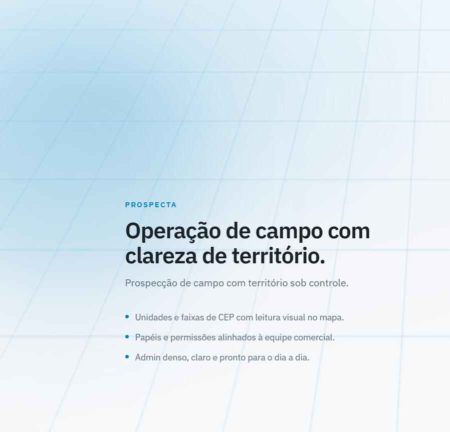

1. Informe e-mail e senha.
2. **Entrar** — adm/gestor caem no admin; vendedor no `/app`.
3. Link **Esqueci a senha** envia reset por e-mail (se mail estiver configurado).

---

## 2. Admin — menu e cadastros

No desktop, use a **barra lateral** (ou o menu superior no mobile). Itens:

| Menu | O que faz |
|------|-----------|
| **Painel** | Mapa Mapbox com unidades, pins, vendedores ao vivo |
| **Agenda** | Plano do dia (X/Y no plano vs meta casa); link para o mapa |
| **Visitas** | Lista e detalhe com foto da fachada + áudio |
| **Unidades** | Território (polígono + faixa de CEP) |
| **Usuários** | Equipe, papel, unidade, CEP base, origem GPS |
| **Papéis** | Roles Spatie e permissões |
| **Integrações** | Status Mapbox / Google / Receita |
| **Documentação** | Fluxo, legendas, como a rota é ordenada |

---

### 2.1 Painel

**URL:** `/admin`

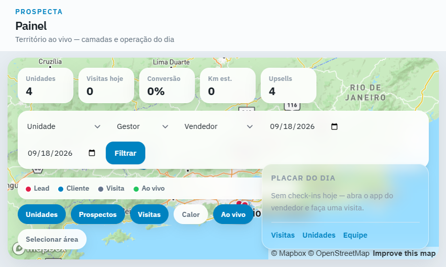

**O que você vê**

- Chips: unidades, visitas hoje, conversão, km estimado, upsells.
- Mapa em tela cheia com polígonos das unidades e pins de prospectos/visitas.
- Camadas e filtros (ex.: ao vivo dos vendedores — ping de GPS do app).

**Selecionar área → criar unidade**

1. No painel, use a ferramenta de desenhar / **Selecionar área**.
2. Feche o polígono em cima dos pins desejados.
3. O sistema estima CEPs e abre o fluxo de **Nova unidade** com o polígono já preenchido (estilo Salesforce: unidade irregular a partir dos pontos no mapa).

---

### 2.2 Visitas — onde ver foto e áudio

**Lista:** `/admin/visitas`

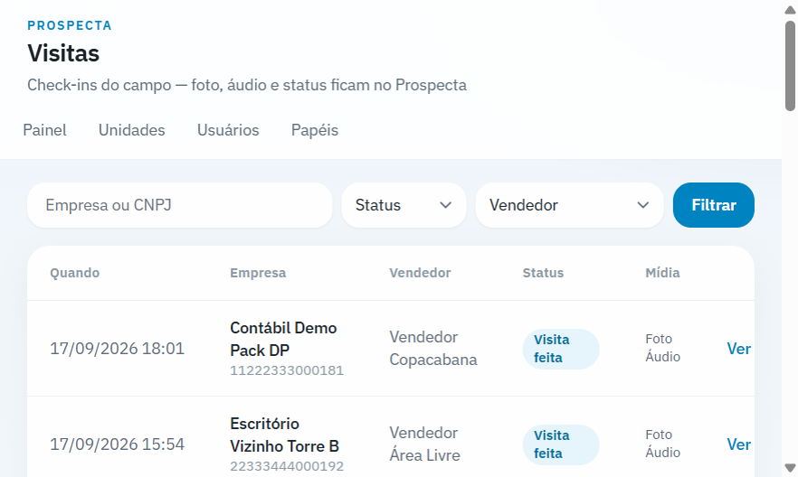

Cada linha é um check-in: empresa, vendedor, status, data. Clique para abrir o detalhe.

**Detalhe:** `/admin/visitas/{id}`

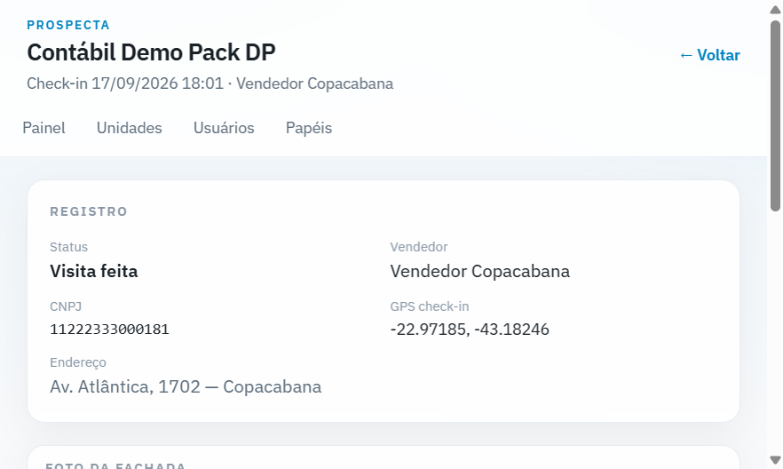

Aqui você confere:

| Campo | Significado |
|-------|-------------|
| **Status** | Visita feita / Retorno / Não tinha ninguém |
| **Vendedor** | Quem fez o check-in |
| **CNPJ / Endereço** | Prospecto visitado |
| **GPS check-in** | Lat/lng no momento do registro |
| **Foto da fachada** | Imagem tirada no celular (obrigatória se status = visita feita) |
| **Áudio do resumo** | Player do áudio gravado no campo |

Sem foto/áudio: a visita pode existir com status que não exige prova (ex.: “não tinha ninguém”); **visita feita** exige os dois no app.

---

### 2.3 Unidades

**Lista:** `/admin/unidades`

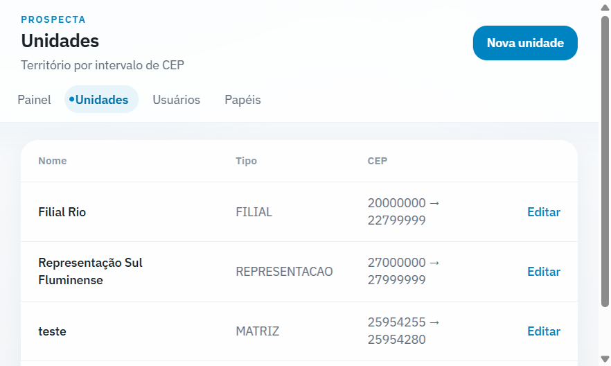

Mostra nome, tipo (Filial / Representação etc.), faixa de CEP e atalho para editar.

**Criar / editar:** `/admin/unidades/criar` ou `/admin/unidades/{id}/editar`

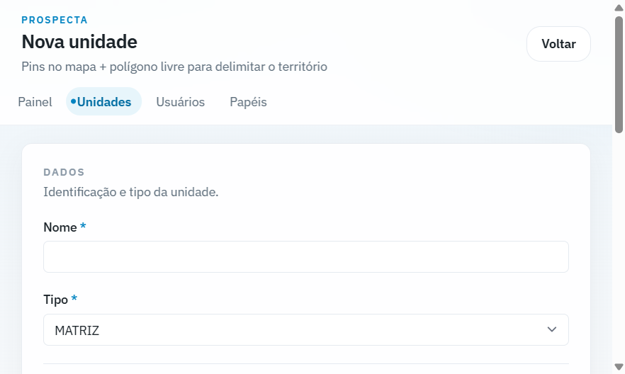

**Como cadastrar**

1. **Nome** e **Tipo** (obrigatórios).
2. **CEP início / CEP fim** — regra oficial de território (quem pode prospectar onde).
3. No **mapa** (direita): desenhe o polígono (Mapbox Draw) — forma livre, não precisa ser retângulo.
4. Opcional: pins de prospectos ajudam a enxergar a área.
5. **Salvar**.

Vendedor **sem unidade** trabalha em “área livre”, mas **não** invade polígono/CEP de outra unidade.

---

### 2.4 Usuários

**Lista:** `/admin/usuarios`

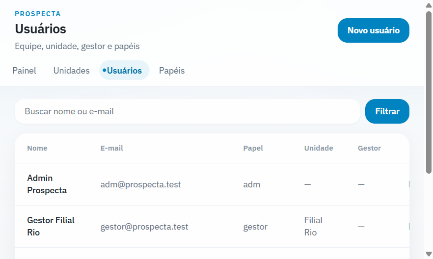

**Novo usuário:** `/admin/usuarios/criar`

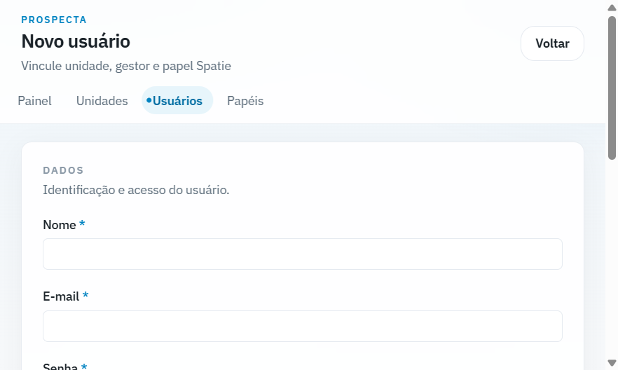

**Campos**

| Seção | Campos |
|-------|--------|
| **Dados** | Nome, e-mail, senha, papel (Administrador / Gestor / Vendedor) |
| **Território** | Unidade, gestor, CEP base início/fim |
| **Origem** | Rótulo (hotel/escritório) + lat/lng preferenciais para rota |

Dica: vendedor de campo deve ter papel **Vendedor** e, se for de filial, a **unidade** correta.

---

### 2.5 Papéis

**Lista:** `/admin/papeis`

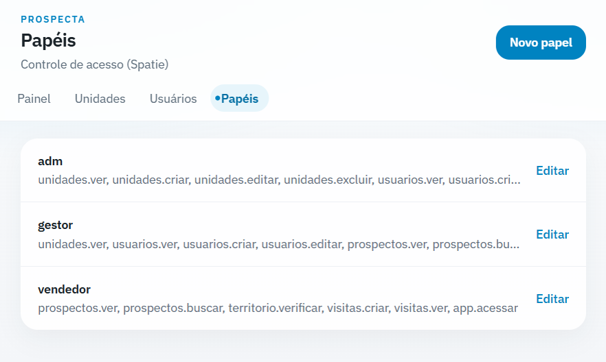

**Criar:** `/admin/papeis/criar` — só o **nome**; permissões na edição.

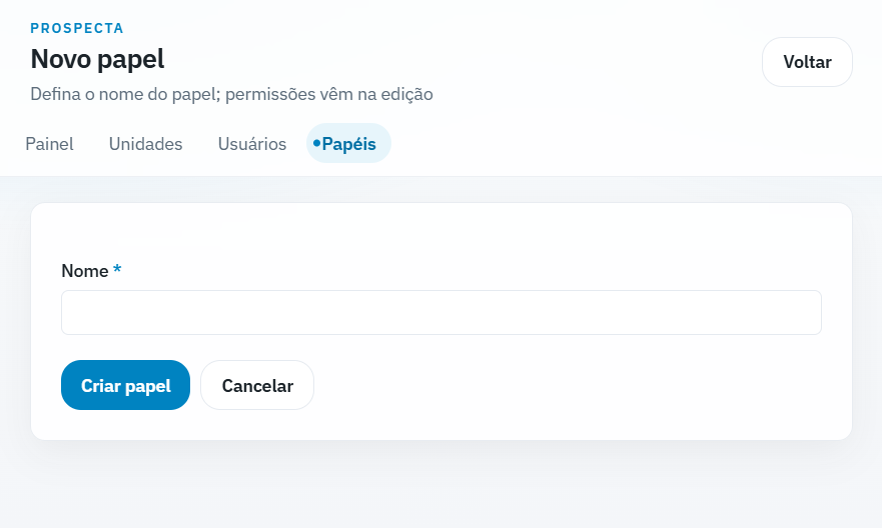

Papéis seed padrão: `adm`, `gestor`, `vendedor` (com permissões Spatie já ligadas).

---

### 2.6 Integrações

**URL:** `/admin/integracoes`

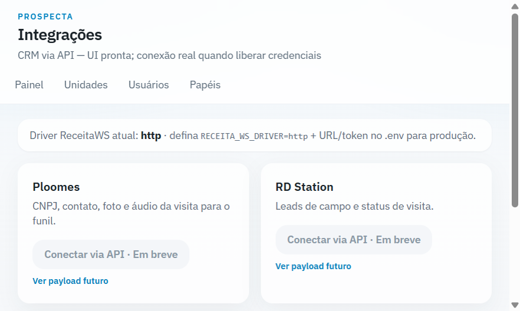

Consulta rápida se Mapbox, Google Maps/Places e Receita WS estão configurados no `.env` (sem expor segredos).

---

## 3. App de campo (vendedor)

**URL base:** `/app`  
Menu inferior fixo: **Setup → Área → Rota → Check-in**.

Sem **Setup** salvo, área/rota/check-in ficam bloqueados.

---

### 3.1 Setup do dia

**URL:** `/app/setup`

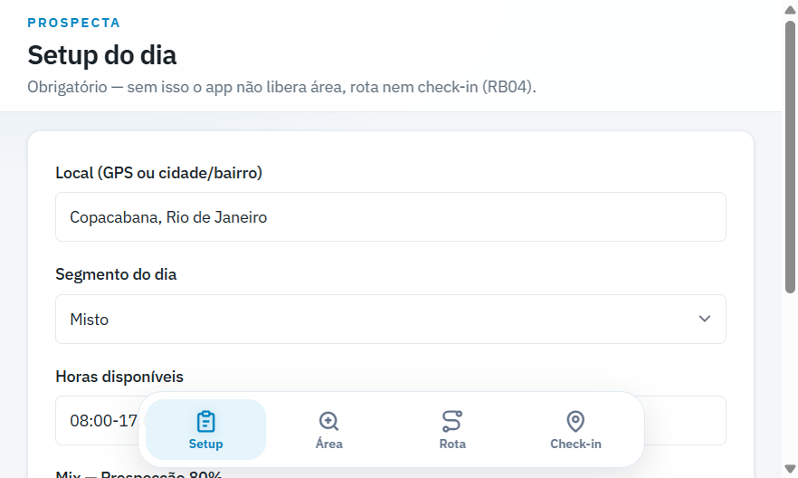

Preencha e salve:

| Campo | Exemplo |
|-------|---------|
| Local | Copacabana ou lat,lng do GPS |
| Segmento | MISTO / LEAD / CLIENTE |
| Horas | 08:00-17:00 |
| % Prospecção | 80 |

Depois: **Salvar e ir para Área**.

---

### 3.2 Onde prospectar (Área)

**URL:** `/app/area`

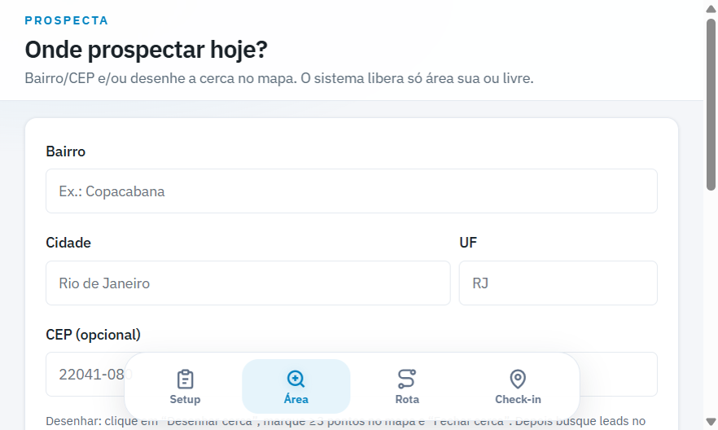

1. Escolha **UF** (select) → digite **cidade** → digite **bairro** (CEP opcional).
2. Ao digitar cidade, a lista vem do **IBGE** (só municípios da UF) — “gua” já encontra Guapimirim. Bairro: **ViaCEP** na cidade (+ Google filtrado pelo município real, sem “Rua Teresópolis” em outro lugar).
3. Ou clique **Desenhar cerca** → marque ≥3 pontos no mapa → **Fechar cerca**.
4. O sistema valida território (sua unidade / área livre / bloqueio).
5. **Buscar leads na área** — Google Places; pins entram no mapa e no `localStorage` para a rota.

---

### 3.3 Rota do dia

**URL:** `/app/rota`

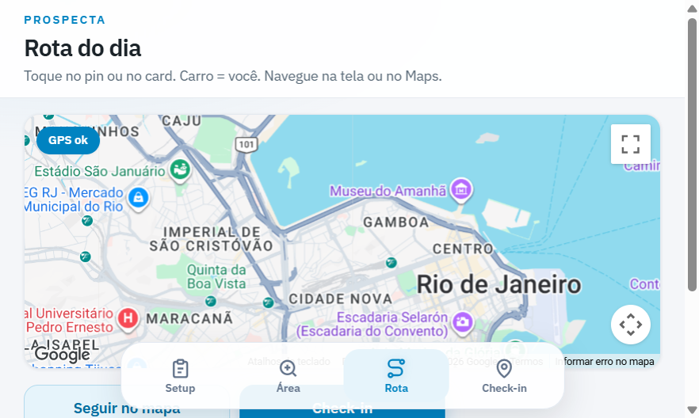

**Como a sequência é calculada** (backend `RotaService` — o Google só desenha):

1. Leads marcados na Área + origem do Setup + mix/horas/segmento.
2. Filtro de raio conforme o % de prospecção.
3. Agrupa “prédio” (~50 m / mesmo endereço) = 1 deslocamento.
4. Ordena a partir do **GPS do vendedor**: grupo/parada mais perto primeiro (vizinho-mais-próximo); dentro do prédio também por proximidade. Prédios grandes não “furam fila”.
5. Encaixa nos horários do dia (almoço + regras de segmento).
6. Maps/Waze recebem waypoints **nessa ordem** (sem otimizar pelo Google).

**Por que não ordena “pela rua”?** Distância rodoviária exigiria Distance Matrix/Directions do Google a cada combinação (custo, cota, latência). Hoje a ordem é heurística barata; a navegação (Maps/Waze) já segue a rua. Melhoria futura: Matrix.

Na tela:

- Mapa com pins numerados e o **carro** = sua posição GPS.
- Lista de paradas com guia de bolso (pitch).
- **Seguir no mapa** — câmera acompanha o vendedor sem pular para outra cidade.
- **Abrir no Google Maps** — navegação externa com waypoints.
- Ao gerar a rota, o **plano é publicado** e aparece na **Agenda** do admin/gestor.
- Toque no pin/card para detalhes; depois vá ao **Check-in**.

Sem leads: mensagem pedindo para voltar em Prospectar/Área.

---

### 3.4 Check-in

**URL:** `/app/checkin`

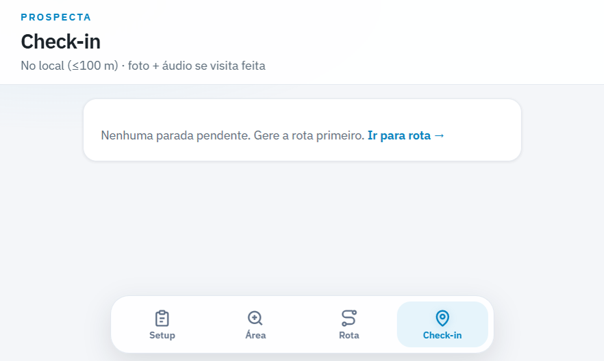

Sem rota gerada: “Nenhuma parada pendente” + link para a rota.

**Com parada ativa**

1. Mini-mapa: pin da empresa + seu carro; badge **No local · Xm** se ≤ 100 m.
2. Leia pitch / upsell (se for cliente).
3. Escolha o **resultado**:
   - Visita feita → **foto da fachada** + **áudio** (~15 s) obrigatórios
   - Retorno agendado
   - Não tinha ninguém
4. **Salvar** só libera dentro dos 100 m (front + servidor).

Depois do save, a visita aparece em **Admin → Visitas** (foto e áudio inclusos).

---

## 4. Onde cada coisa “aparece”

| O que o usuário faz | Onde o gestor/adm vê |
|---------------------|----------------------|
| Desenha unidade / CEP | **Unidades** + polígono no **Painel** |
| Cadastra vendedor | **Usuários** |
| Vendedor faz setup + hunting | Pins no app; prospectos no banco |
| Vendedor gera rota e se move | GPS no **Painel** (ao vivo, janela de minutos) |
| Check-in com foto/áudio | **Visitas** → detalhe |

Dados ficam no Prospecta (MySQL/SQLite conforme `.env`). Exportação CRM ainda não é o produto.

---

## 5. Atalhos úteis

| Ação | Caminho |
|------|---------|
| Login | `/login` |
| Painel | `/admin` |
| Visitas | `/admin/visitas` |
| Nova unidade | `/admin/unidades/criar` |
| Novo usuário | `/admin/usuarios/criar` |
| App vendedor | `/app` ou `/app/setup` |

Se o fluxo do app “travar” entre telas, limpe no DevTools → Application → Local Storage as chaves `prospecta.setup`, `prospecta.leads`, `prospecta.rota`.

Guia técnico complementar: [COMO-TESTAR.md](../COMO-TESTAR.md).

---

## Índice das capturas

| Arquivo | Tela |
|---------|------|
| `screenshots/01-login.png` | Login |
| `screenshots/02-painel.png` | Painel / mapa |
| `screenshots/03-visitas-lista.png` | Lista de visitas |
| `screenshots/04-visita-detalhe.png` | Detalhe (foto + áudio) |
| `screenshots/05-unidades-lista.png` | Unidades |
| `screenshots/06-unidade-criar.png` | Cadastro de unidade |
| `screenshots/07-usuarios.png` | Usuários |
| `screenshots/08-papeis.png` | Papéis |
| `screenshots/09-integracoes.png` | Integrações |
| `screenshots/10-app-setup.png` | Setup do dia |
| `screenshots/11-app-area.png` | Área / cerca |
| `screenshots/12-app-rota.png` | Rota |
| `screenshots/13-app-checkin.png` | Check-in |
| `screenshots/14-usuario-criar.png` | Novo usuário |
| `screenshots/15-papel-criar.png` | Novo papel |
